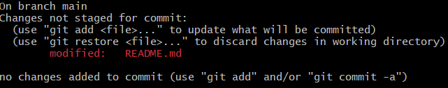
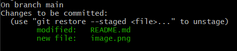
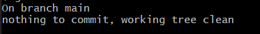

# CLASES DE GIT Y GITHUB
### Que es un contro de versiones
Un control de versiones es un sistema que registra cada
cambio que se realiza en el código fuente de un proyecto. Esto
te permite tener un histórico de todos los cambios producidos
en sus ficheros, saber quién lo hizo y cuándo.

### Que es git
es un sistema distribuido , que aloja una copia completa del repocitorio en cada maquina local que trabaja en un mismo codigo, es decir que varias personas pueden entrar a un repositorio y cambiar el codigo o modificarlo.

### instalacion
colocar vs code como defecto\
verificar si el archivo de instalacion es el que nesesitas o acepta, (en mi computadora no hacepta arm y tuve que cambiar a adm)

## Iniciar un proyecto con git
### PASOS
*crear una carpeta\
-(nombre carpeta)==(git)

*abrir git bash\
-clic derecho dentro de la carpeta\
-abrir git bash

*Inicializar proyecto git\
-escribir <git init> en terminal bash (comprobar que funciono, cuandoaparece main en verde)

*Crear archivo vs code\
-abrir vs code con la carpeta en la que esta el git\
-crear un archivo en vs code (README.md) o (nombre de archivo x)

# STATES Y COMMITS

## 3 estados de git

### Modified
El archivo ha sido creado, eliminado o contiene cambios que no han sido marcados como confirmados (esta en estado de modificacion, es decir que se cambiaron cosas)\
-Para poder entrar en este estado tienes que guardar el proyecto que realizas, esose puede con "ctrl + s"

### Staged
El archivo a sido marcado como preparado para ser confirmado en el repositorio local\
-<git add (nombre de la rama)>(para selecccionar una sola rama)\
-<git add .> (para seleccionar todas las ramas)

### Commited
El archivo se encuentra grabado en el repositorio local. Esta accion recive el nombre de commit\
-<git commit> (poner refencia commit manual)\
-<git commit -m (referencia del commit)> (para poner la refencia de forma automatica)

## Que es commit
en terminos sencillos un commit es como un punto de guardado de un juego para poder guardar  el progreso realizado

## Que es el HEAD
Entiende HEAD comoun "estas aqui" de un mapa. Solo podemos estar en un lugar el cual es HEAD (en mayusculas)\
HEAD es el puntero de referencia el caul te indica en cual commit estas.

# RAMA, MERGE Y CONFLICTOS
## Que es una rama
Es una paricion de la rama principal, a nivel tecnico es un apuntador hacia una de las confirmaciones, es decir que apunta a un commit del cual sale  otra particion a la cual se denomina rama\
Su funcion es que varios participantes pueden modificar cada quien por su lado y al final vuelve todo a la rama principal\
SON PUNTEROS AL PRIMERO DE LA LISTA O A UN COMMIT CREADO\
<git branch (nombre de rama)> crea una rama\
<git switch (nombre de rama)> cmabia entre ramas\
-Si el puntoro HEAD esta en una rama mas abajo de otra no se poda ver la rama, es decir si una rama A esta mas abajo de una rama B si el puntero HEAD semueve a la rama A, La rama B no se vera por que esta siguiendo otra linea.\
-si la rama A ya hizo una particion y la rama B de igual manera, estando sobre cualquiera de las las dos no se podra ver la otra, incluso si esta se encuentra arriba.

## CODIGOS USADOS
##Inicializar un acrhivo con git

### <git init>
inicializa un archivo con git (para que dicho archivo pueda usar git)

## Los estados de los archivos

### <git add>
#### <git add (nombre de archivo)>
-Esto hace que  el archivo pase a estado Staged\
-selcciona solo una archivo en especifico

#### <git add .>
-esto hace pasar todas los archivos que existan a estado Staged\
-todas las ramas pasa a estar en estado Staged

### <git commit>
#### <git commit>
Es una forma  manual de poner una referencia al commit es decir algo que indique por que lo guardas en ahi o que cambio hiciste, es manual por que te manda al vs code y de ahi puedes poner un nombre al commit.

#### <git commit -m "(referencia del commit)">
Es una formarapida y sencilla, directo del terminal ingresas la referencia commit para no tener que ir a vs code

#### <git commit --amend -m "(hubo un cambio de mensje de commit)">
es un codigo de commit, hace que se cambie el nombre de un comit (no es cambiar, es basicamente hacer un nuevo commit pero sin cambiar nada solo el nombre del commit)

#### <git add . && git commit -m "(referencia del commit)">
esto es una forma rapida de pasar los pasos directamente para el guardado.

### <git log>
#### <git log>
poder ver los commit guardados(con fecha, usuario, correo, y nombre de commit)

#### <git log --oneline>
Solo para poder ver lo que nos interesa que es nombre del commit y numeroClave del commit

#### <git log | grep (numeroClave)>
Es para ver solo el commit con ese numeroClave

## Ramas

### <git branch>
Es para poder ver todas las ramas que hay

### <git branch (nombre de rama)>
Es para crear una rama con un nombre x

### <git switch (nombre de rama)>
Comando recomendado para cambiar entre ramas

### <git switch -c (nombre rama)>
Sirve para crear una rama y directamente cambiar de posicion a ella 

### <git checkout (nombre de rama)>
Primer comando que se creo para cambiar de ramas, pero no es su unica funcion...?

## Comandos curiosos

### <(codigo) -help>
te manda a un sitio web donde estan todos los las convinaciones de codigo de dicho codigo

### <git status>
poder ver el estado del archivo git (si hay alguna rama que esta en algun estado)

### <ls>
Significa "listar". Se utiliza para mostrar el contenido de un directorio, incluyendo archivos y subdirectorios. Por defecto, lista los nombres de los archivos y subdirectorios en el directorio actual, ordenados alfabéticamente. 

### <cd>
Significa "change directory", que en español significa "cambiar directorio". Se utiliza para cambiar el directorio de trabajo actual en la terminal. Al ejecutar cd, puedes navegar por el sistema de archivos y cambiar a diferentes carpetas para realizar tareas en ellas.