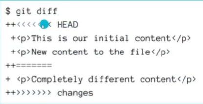

# CLASES DE GIT Y GITHUB
### Que es un contro de versiones
Un control de versiones es un sistema que registra cada
cambio que se realiza en el código fuente de un proyecto. Esto
te permite tener un histórico de todos los cambios producidos
en sus ficheros, saber quién lo hizo y cuándo.

### Que es git
es un sistema distribuido , que aloja una copia completa del repocitorio en cada maquina local que trabaja en un mismo codigo, es decir que varias personas pueden entrar a un repositorio y cambiar el codigo o modificarlo.

### instalacion
colocar vs code como defecto\
verificar si el archivo de instalacion es el que nesesitas o acepta, (en mi computadora no hacepta arm y tuve que cambiar a adm)

## Iniciar un proyecto con git
### PASOS
*crear una carpeta\
-(nombre carpeta)==(git)

*abrir git bash\
-clic derecho dentro de la carpeta\
-abrir git bash

*Inicializar proyecto git\
-escribir <git init> en terminal bash (comprobar que funciono, cuandoaparece main en verde)

*Crear archivo vs code\
-abrir vs code con la carpeta en la que esta el git\
-crear un archivo en vs code (README.md) o (nombre de archivo x)

# STATES Y COMMITS

## 3 estados de git

### Modified
El archivo ha sido creado, eliminado o contiene cambios que no han sido marcados como confirmados (esta en estado de modificacion, es decir que se cambiaron cosas)\
-Para poder entrar en este estado tienes que guardar el proyecto que realizas, esose puede con "ctrl + s"

### Staged
El archivo a sido marcado como preparado para ser confirmado en el repositorio local\
-<git add (nombre de la rama)>(para selecccionar una sola rama)\
-<git add .> (para seleccionar todas las ramas)

### Commited
El archivo se encuentra grabado en el repositorio local. Esta accion recive el nombre de commit\
-<git commit> (poner refencia commit manual)\
-<git commit -m (referencia del commit)> (para poner la refencia de forma automatica)

## Que es commit
en terminos sencillos un commit es como un punto de guardado de un juego para poder guardar  el progreso realizado

## Que es el HEAD
Entiende HEAD comoun "estas aqui" de un mapa. Solo podemos estar en un lugar el cual es HEAD (en mayusculas)\
HEAD es el puntero de referencia el caul te indica en cual commit estas.

# RAMA, MERGE Y CONFLICTOS
## Que es una rama
Es una paricion de la rama principal, a nivel tecnico es un apuntador hacia una de las confirmaciones, es decir que apunta a un commit del cual sale  otra particion a la cual se denomina rama\
Su funcion es que varios participantes pueden modificar cada quien por su lado y al final vuelve todo a la rama principal\
SON PUNTEROS AL PRIMERO DE LA LISTA O A UN COMMIT CREADO\
<git branch (nombre de rama)> crea una rama\
<git switch (nombre de rama)> cmabia entre ramas\

### casos de una rama
-Si el puntoro HEAD esta en una rama mas abajo de otra no se poda ver la rama, es decir si una rama A esta mas abajo de una rama B si el puntero HEAD semueve a la rama A, La rama B no se vera por que esta siguiendo otra linea.\
-si la rama A ya hizo una particion y la rama B de igual manera, estando sobre cualquiera de las las dos no se podra ver la otra, incluso si esta se encuentra arriba.

## fusionar ramas(merge)
Las bifurcaciones de código que hemos creado en forma de ramas tendrán dosdestinos: acabar en el olvido para no terminar en ningún lado o ser fusionada en otra rama.\
de otras ramas fucionar a la principal para poder traer todos los datos de esa rama.\
<git merge -- edit> abre el editor antes de hacer el commit.\
<git merge --no-commit> evita que haga comit automaticamente.\
<git merge (nombre de la rama de la cual se quiere los datos)> esto quiere decir que se traeran los datos de esa rama a la rama en la cual esta ubicado el HEAD

### fast-foward
-La rama realiza un fast-foward cuando se trajo los datos sin nesesidad de un commit adicional, lo que significa que no hubo conflictos, y eso dice que no se modificaron archivos que ya estaban (solo se anadio mas archivos).\
mueve el puntero a el commit de la rama la cual se trajeron los datos.\
<git merge (nombre de rama) --no-ff> se crea el comit, sirve para que no se haga el fast-foward

### commit de fusion
Esto se da cuando no hay "fast-foward", esto se ocaciona cuando hubo cambios en el mismo archivo de las dos ramas que se quieren fucionar\
-Esto hace que los commits de ambas ramas se fucionen y creen un commit el cual es la fucion de las dos ramas\
-Pero solo la rama en la cual se encontraba HEAD->(main) al momento de la fucion es la que apuntara al nuevo commit de fucion; para areglar dicho problema se soluciona apicando el codigo <git merge (main)> en la rama(rama 1) y asi poder mover el puntero de la rama(rama 1) a donde esta el main, esto aria que los punteros de las ramas esten en el mismo commit.

### Eliminar ramas por que?
Porque es una buena practica, las ramas tienen un unico proposito que puede ser areglar bugs, cambios experimentales,etc; eso nos da a entender que tiene un uso para un corto periodo de tiempo.\
<git branch -d (nombre de la rama)> para eliminar ramas que no tienen un commit que no ha sido mergeado(no hubo fucion, tiene un commit), es decir que puede eliminar ramas que han sido fucionadas.\
-te da un error que dice que la rama no fue fucionada, y puede tener valor.\
<git branch -D (nombre de la rama)> Para elmininar cualquier rama, incluso si no fue mergeada (fucionada).

## Conflictos
Esto se ocaciona cuando en la rama destino se an realizado cambios en un mismo archivo que en la rama que se extraen los datos, es decir que git no sabe cual poner como primero por que hay datos de los dos lados y se ocacionan conflictos.\

<git diff> para ver los conflictos, si no lo muestra\
-Siempre abra conflictos, pero nuestro trabajo es saber como areglarlo

# GITHUB
## git y github son lo mismo?
-git es un control de versiones\
-github es un servicio de alojamiento en la nube de codigo fuente basado en el sistema de control de versiones que git ofrecce para manejar repositorios

### repositorio
Un reposiorio es un proyecto en el cual estas trabajando puede ser publico o privado

### organizacion
Si yo anado a alguien a un repositorio esas personas podria ver los repositorios de esa organizacion, luego en ahi podes poner repositorios publicos o privados y asi no tener que pedir permisos para hacer un proyecto nuevo en conjunto

### repositorios remotos
Son repositorios que estan hospedados en un servidor y que servira de punto  de sincronizacion entre diferentes repositorios locales.\
Es decir que cada uno hace un repositorio local elcual es el que tenemos nostros, pero en algun momento tenemos que unirlo todo, y para eso esta el repositorio remoto

### github actions
Es un lugar apartado donde puedes actomotizar cosas que si bien se podria hacer manuales, seria mas recomendamendable automatizarlas por que la mayoria del tiempo una persona se olvida, pero ahi como se puede automatizar no seria mas facil hacer tareas complejas

## Enlazar un repositorio local a un repositorio remoto
### Con repositorio nuevo
Para cuando ya tenemos en el vs code avanzado y queremos en github\
-Se crea un repositorio en github(en ahi abra una url)\
-se escribe <git remote> Comando para ver repositorios (sincronizar o desincronizar cosas)
-se escribe <git remove add (origin) (url)> esto es para conectar el git con el github, se ingresa eto en terminal git con la url de github

### con repositorio que ya existe
Cuando ya hay un archivo que ya esta avanzado o cuando nos comparten un repositorio que no tenemos guardado <git clone>

-dentro del repositorio en github vamos a dode dice (<>code)\
-copiamos la url que esta en https

-vamos a git bash y escribimos <cd ../> que hace que vuelva un archivo detras(en ese momento estaremos en Desktop(escritorio))

-luego ingresamos en la terminal git bash <git clone (enlace url de github)> esto clonara el proyecto en el escritorio (Desktop)

-vamos al archivo con <cd ./(nombre_del_archivo)/> (ya inicia con el git init no hay nesesidad de ingresar); nota: si el archivo tiene el espacio se escribiria de la siguiente manera "cd ./nombre\ del\ archivo/" otraopcion es colacar nombres con "_", "nombre_del_archivo"

### Llave ssh
Para evitar que alguien se haga pasar por ti, es como un identificador para evitar hackeos\
PASOS:\
*Listamos las llaves SSH que ya tenemos\
-$ ls -al ~/.ssh\
*Crear key SSH\
-ssh-keygen -t rsa -b 4096 -C "tu.email@gmail.com"\
-presionar enter\
-passphrase\
*Poner en marcha nuestro key SSH\
-eval "$(ssh-agent -s)"\
*Añadir key SSH\
-ssh-add ~/.ssh/id_rsa\
*Copia en portapapeles\
-clip < ~/.ssh/id_rsa.pub\
*Pegar en la sección “key”\
-https://github.com/settings/ssh/new

## Escribir sobre el repositorio remoto
para poder subir cambios al repositorio remoto debemos ingresarel comando <git push (origin) (main)> (origin)==(nombre que le dimos al repositorio remoto, ES UN ALIAS)\
(main) es igual a que rama queremos que se suba a dicho repositorio local\
esto hace que los cambios de esa rama se suban al repositorio remoto\

## Crear una rama remota
-crear una rama<git switch -c (nombre de rama)>\
-<git push (origin) (nombre rama)>\
la rama debe existir en tu repositorio local, sino se ocacciona un error

## Eliminar ramas de mi repocitorio local que ya no usan
-vamos a la rama en github la eliminamos
-pero eso no se vera en el git, entonces tenemos que ingresar <git prune origin> esto hace que se actulicec el git y vea que se elimino una rama

## diferencia entre git push y git pull
-<git push>\
nos sirve para enpujar cualquier cambio o modificarlo del repocitorio local al repositorio remoto\
<git push --all> actuliza todas las rama en su referencia adecuada, es decir el main al main, etc, es decir que todas las ramas se actulizan en el repositorio remoto\
<git push -u origin (rama1)(rama2)(ramaN)> es masomenos la idea del --all pero solo con algunas ramas, es decir que lleva algunas ramas al repositorio remoto
<git push -f> esto hace que a fuerza se escriba el repositorio remoto a tu rama local, esto puede ser peligroso por que si otro esta trabajando en la misma rama sus cambios seran perdidos
<git push -d origin (rama)> borrar ramas remotas

-<git pull>\
nos sirve para jalar o descargar los cambios o modifiaciones del repositorio remoto al repositorio local

## CODIGOS USADOS

## Inicializar un acrhivo con git

#### <git init>
inicializa un archivo con git (para que dicho archivo pueda usar git)

## Los estados de los archivos

#### <git status>
poder ver el estado del archivo git (si hay alguna rama que esta en algun estado)

### Psar a estado Modified

<ctrl + s>
Guarda el archivo y el archivo pasa a estar en estado modified

### Pasar a estado Staged

#### <git add (nombre de archivo)>
-Esto hace que  el archivo pase a estado Staged\
-selcciona solo una archivo en especifico

#### <git add .>
-esto hace pasar todas los archivos que existan a estado Staged\
-todas las ramas pasa a estar en estado Staged

#### <git add pruebas.*>
esto se utiliza cuando hay varios archivos que tienen un nombre.x, es decir que empiezan con lo mismo y se llama a todos ellos.

#### <git add . && git commit -m "(referencia del commit)">
esto es una forma rapida de pasar los pasos directamente para el guardado.

### Pasar a estado commit

#### <git commit>
Es una forma  manual de poner una referencia al commit es decir algo que indique por que lo guardas en ahi o que cambio hiciste, es manual por que te manda al vs code y de ahi puedes poner un nombre al commit.

#### <git commit -m "(referencia del commit)">
Es una formarapida y sencilla, directo del terminal ingresas la referencia commit para no tener que ir a vs code

#### <git commit --amend -m "(hubo un cambio de mensje de commit)">
es un codigo de commit, hace que se cambie el nombre de un comit (no es cambiar, es basicamente hacer un nuevo commit pero sin cambiar nada solo el nombre del commit)

### Ver los commits 

#### <git log>
poder ver los commit guardados(con fecha, usuario, correo, y nombre de commit)

#### <git log --oneline>
Solo para poder ver lo que nos interesa que es nombre del commit y numeroClave del commit

#### <git log --oneline --graph>
esto hace que muestre graficamente los commits, y sus ramas

#### <git log | grep (numeroClave)>
Es para ver solo el commit con ese numeroClave

## Ramas

### Ver ramas

#### <git branch>
Es para poder ver todas las ramas que hay

#### <git branch -a>
para ver todas las ramas que hay, incluso las de la nube(repositorio remoto)

#### <git remote -v>
Para ver las ramas solo del repositorio remoto y a que url esta apuntando

### Crear rama

#### <git branch (nombre de rama)>
Es para crear una rama con un nombre x

#### <git switch -c (nombre rama)>
Sirve para crear una rama y directamente cambiar de posicion a ella 

### Cambiar de ramas

#### <git switch ->
Para cambiar directamente a la rama siguiente 

#### <git switch (nombre de rama)>
Comando recomendado para cambiar entre ramas, incluyendo a una rama remota

#### <git checkout (nombre de rama)>
Primer comando que se creo para cambiar de ramas, pero no es su unica funcion...?

### fucionar ramas

#### <git merge --abort>
Esta comando es para abortar una fucion(algo salio mal)

#### <git merge -- edit>
Abre el editor antes de hacer el commit.

#### <git merge --no-commit> 
Evita que haga comit automaticamente.

#### <git merge (nombre de la rama que se quiere los datos)>
estando el HEAD en la rama a la cual iran todos los datos(main), devemos traer todos los datos de  las otras ramas nombrandolas.

#### <git merge (nombre de rama) --no-ff>
Se crea el comit, sirve para que no se haga el fast-foward.

#### <git rebase (nombre de la rama)>
Este comando ahce que la fucion se realice pero trayendo los datos en conjutno de la rma (rama 1), todo en un commit, basicamente reconstruyendo todos los comit de la rama y haciendo uno solo.

### Elimminar rama

#### <git brach -d>
Sirve para eliminar ramas que no tienen un commit que no ha sido mergeado(no hubo fucion, tiene un commit), es decir que puede eliminar ramas que han sido fucionadas.\
-te da un error que dice que la rama no fue fucionada, y puede tener valor.

#### <git brach -D>
Para elmininar cualquier rama, incluso si no fue mergeada (fucionada).

### enlazar repocitorio local a repocitorio remoto
#### con repositorio nuevo

#### <git remote>
Comando para ver repositorios 

#### <git remote add (origin) (url)>
Esto es para conectar el git con el github, se ingresa estoe comando en terminal git con la url que github te proporciona al momento de crear un nuevo repocitorio

#### con repocitorio existente(clonar)
#### <cd ../> 
Que hace que vuelva un archivo detras(en ese momento estaremos en Desktop(escritorio))

#### <git clone (enlace url de github)> 
Esto clonara el repositorio de github en el escritorio (Desktop)

#### <cd ./(nombre_del_archivo)/> 
Con esto vamos a un archivo del escritorio\
(ya inicia con el git init no hay nesesidad de ingresar)\
nota: si el archivo tiene el espacio se escribiria de la siguiente manera "cd ./nombre\ del\ archivo/" otraopcion es colacar nombres con "_", "nombre_del_archivo"

### Subir cambios del repositorio local al remoto
#### <git push (origin) (main)> 
Esto hace que subamos al repositorio remoto los cambios de una rama que tengamos\
(origin)==(nombre que le dimos al repositorio remoto, ES UN ALIAS)\
(main) es igual a que rama queremos que se suba a dicho repositorio local\

#### <git push -u (origin) (rama)>
la diferencia con el del arriba es que el "-u" hace que tenga una relacion el repocitorio remoto con el local y hace simplemente solo poner <git push> y git lo entiende que es de la rama (main) a la rama(main), pero esto se tiene que hacer para cada rama, sino no funcionara

#### <git push --all> 
Actuliza todas las rama en su referencia adecuada, es decir el main al main, etc, es decir que todas las ramas se actulizan en el repositorio remoto\
#### <git push -u origin (rama1)(rama2)(ramaN)> 
Es masomenos la idea del --all pero solo con algunas ramas, es decir que lleva algunas ramas al repositorio remoto
#### <git push -f> 
Esto hace que a fuerza se escriba el repositorio remoto a tu rama local, esto puede ser peligroso por que si otro esta trabajando en la misma rama sus cambios seran perdidos

### traer ramas del repositorio remoto
#### <git fetch>
esto actualiza las referencias de que ramas existe en mi repositorio remoto, y se ve las ramas del repositorio remoto

#### <git pull origin (nombre de rama)>
despues de movernos a esa rama en el repositorio remoto ingresas esto para que lo lleve al repositorio local tuyo, por que de no hacerlo puede que la rama directamente se fucione con la rama main.

### eliminar una rama de repositorio remoto

#### <git push -d origin (rama)>
Borrar ramas remotas

#### <git prune origin>
Esto hace que se actulice el git y vea que se elimino una rama,
hace basicamente que si se elimino una rama lo vea desde el git

### Comandos curiosos

#### <git config list>
lista de configuraciones, dode esta toda la configuracion sobre mi

#### <(codigo) -help>
te manda a un sitio web donde estan todos los las convinaciones de codigo de dicho codigo

#### <ls>
Significa "listar". Se utiliza para mostrar el contenido de un directorio, incluyendo archivos y subdirectorios. Por defecto, lista los nombres de los archivos y subdirectorios en el directorio actual, ordenados alfabéticamente. 

#### <cd>
Significa "change directory", que en español significa "cambiar directorio". Se utiliza para cambiar el directorio de trabajo actual en la terminal. Al ejecutar cd, puedes navegar por el sistema de archivos y cambiar a diferentes carpetas para realizar tareas en ellas.